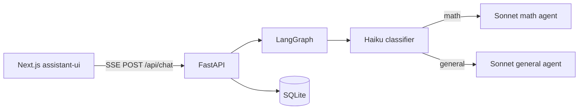

# mvpbot

Demo AI assistant: **LangGraph** intent routing + **FastAPI** SSE backend, and a **Next.js** UI built with **assistant-ui** (threads, search, reasoning display).



## Repository layout

| Path | Description |
|------|-------------|
| [`backend/`](backend/) | Python package `assistant-service`: LangGraph graph, Anthropic models, FastAPI, SQLite |
| [`frontend/`](frontend/) | Next.js app: `useRemoteThreadListRuntime` + `useExternalStoreRuntime`, SSE client |

## Prerequisites

- Python 3.11+ with [uv](https://github.com/astral-sh/uv)
- Node.js 20+ with Yarn (or use `npx` / `npm` as you prefer)
- [Anthropic API key](https://console.anthropic.com/)

## Backend (assistant service)

```bash
cd backend
cp .env.example .env
# Set ANTHROPIC_API_KEY in .env

uv sync --all-extras
uv run uvicorn assistant_service.main:app --reload --host 0.0.0.0 --port 8000
```

- Health: `GET http://localhost:8000/health`
- SQLite file (default): `backend/data/assistant.db`

### Tests

```bash
cd backend
uv run pytest tests/ -v
```

## Frontend

```bash
cd frontend
cp .env.example .env.local
# Optional: NEXT_PUBLIC_API_URL=http://localhost:8000

yarn install
yarn dev
```

Open [http://localhost:3000](http://localhost:3000).

## API (for other clients)

Base URL: `http://localhost:8000` (set `NEXT_PUBLIC_API_URL` in the frontend).

| Method | Path | Description |
|--------|------|-------------|
| `GET` | `/health` | Liveness |
| `POST` | `/api/threads` | Create thread; body optional `{"id": "<uuid>"}` for client-generated id |
| `GET` | `/api/threads` | List threads; `?q=` search, `include_archived=true` |
| `GET` | `/api/threads/{id}` | Thread metadata |
| `PATCH` | `/api/threads/{id}` | Body: `title`, `archived` |
| `DELETE` | `/api/threads/{id}` | Delete thread and messages |
| `GET` | `/api/threads/{id}/messages` | List messages (`content`, `reasoning` for assistant) |
| `POST` | `/api/chat` | **SSE** stream; body `{"thread_id", "message"}` |

### SSE events (`POST /api/chat`)

Each line is `data: <json>`:

- `{"type": "reasoning", "content": "..."}` — extended thinking token (Anthropic → LangChain `reasoning` blocks)
- `{"type": "token", "content": "..."}` — assistant answer text
- `{"type": "done"}` — stream finished
- `{"type": "error", "message": "..."}` — error

## Behavior

1. **Classifier** (`claude-haiku-4-5`) picks `math` vs `general` (see [Anthropic models](https://docs.anthropic.com/en/docs/about-claude/models/overview)).
2. **Subagents** (`claude-sonnet-4-20250514`) use Anthropic **extended thinking**; reasoning is streamed separately from the answer for the UI.

## License

MIT — see [LICENSE](LICENSE).
